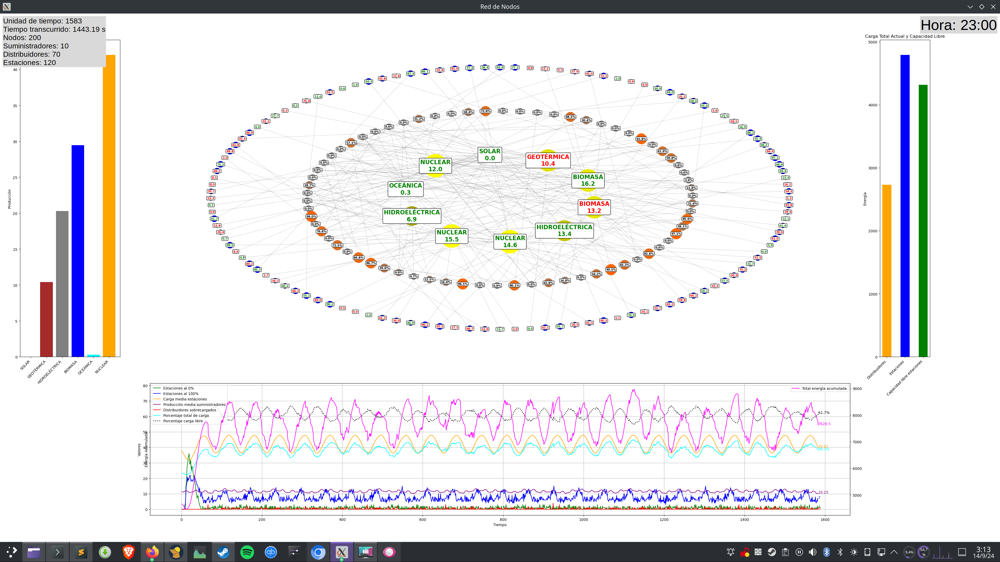

# Here's the translation of the file into English while maintaining the markdown format:

# Energy Network Simulation

This project simulates a network of interconnected nodes representing different types of entities within an energy system: suppliers, distributors, and stations. Using the `NetworkX` framework to model graphs and `Tkinter` for the graphical interface, the simulation shows how energy flows between different nodes and statistics related to energy production and consumption.



## Features

- **Network generation**: A Barabási-Albert graph is generated with 250 nodes, which are then classified into three types:
  - **Suppliers**: Generate energy from different sources (Solar, Wind, Geothermal, etc.).
  - **Distributors**: Mediate the flow of energy between suppliers and stations.
  - **Stations**: Consume or store energy, simulating charging stations.

- **Energy flow**: Over time, suppliers generate energy, which is distributed by distributors to the stations. The amount of energy generated and distributed changes dynamically depending on the type of energy and the characteristics of each node.

- **Visual update**: The network is visually updated in real-time, showing:
  - **Node sizes**: Based on the amount of energy they contain.
  - **Colors**: Represent the charge level (yellow for suppliers, blue for stations, orange for distributors).
  - **Additional graphs**:
    - **Bar graph**: Total load in distributors and stations, in addition to free capacity.
    - **Energy mix**: Total production for each type of energy.

## Node rules and behavior

1. **Suppliers**:
   - Generate energy according to their type (Solar, Wind, Nuclear, etc.).
   - Energy is produced following a series of time functions that vary according to the type of energy. For example, solar energy depends on the time of day, while wind energy fluctuates quickly.

2. **Distributors**:
   - Receive energy from suppliers and send it to stations. If they receive too much energy, they can overload and stop sending energy.

3. **Stations**:
   - They can store energy up to a maximum capacity. The stored energy fluctuates according to a sinusoidal pattern that simulates energy consumption and charging.

## Information in the graphs

The script presents several graphs to visualize the state of the network:

- **Node Network**: Displays suppliers, distributors, and stations. The colors and sizes of the nodes change according to the energy level.
- **Temporal evolution graph**: Visualizes key statistics, such as:
  - Stations at 0% or 100% charge.
  - Average station charge.
  - Average supplier production.
  - Percentage of total network charge.
- **Bar graph (right)**: Shows the total load of distributors, stations, and the free capacity of the stations.
- **Energy mix (left)**: Breaks down the total energy production by type (Solar, Wind, etc.).

## Dependencies

To run this project, make sure you have the following dependencies installed:

- `networkx`: For graph creation and manipulation.
- `matplotlib`: For graph visualization.
- `numpy`: For advanced mathematical functions.
- `tkinter`: For the graphical interface.

You can install them by running:

```bash
pip install networkx matplotlib numpy
